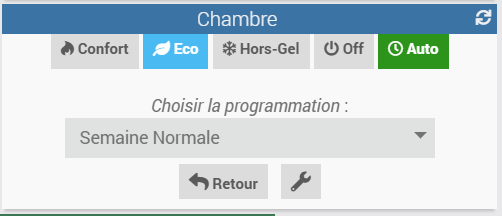
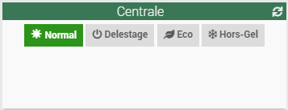

# Plug-In Jeedom Centrale Fil-Pilote (centralepilote)

Ce plugin apporte une centrale de programmation pour envoyer les ordres "fil-pilote" (Confort, Eco, Hors-Gel, ...) aux radiateurs supportant cette fonction et équipés des contacteurs connectés nécessaires.
Le plugin ne pilote pas des contacteurs connectés spécifiques, mais utilise une notion inspirée du plugin virtuel pour utiliser tout type de contacteurs (Zigbee, WiFi, Z-wave, EnOcean, ...) déjà gérés par Jeedom.

### Comprendre le fonctionnement d'un "Fil-Pilote"

En attendant une description dans cette page, vous pouvez aller voir : https://fr.wikipedia.org/wiki/Chauffage_%C3%A9lectrique#Fil_pilote

### Créer un Radiateur "Fil-Pilote"

Lors de la création d'un équipement de type "Radiateur", il va falloir indiquer comment est réalisé la fonction de fil-pilote pour ce radiateur. Autrement dit quels contacteurs sont utilisés pour envoyer les ordres fil-pilote au radiateur.
Le plugin offre actuellement 4 possibilités. Les 3 premières sont à base de contacteurs simples on/off, la 4ème est à base d'objets virtuels, et permet (normalement) de couvrir tous les autres cas d'objets connectés permettant d'envoyer une commande fil-pilote sans être des contacteurs simples.

Un schéma permet de bien expliciter comment est réalisé la fonction de fil pilote, et ainsi simplifier la chose.

- Constitution du fil-pilote par deux commutateurs

Cette méthode permet de supporter les 4 modes : Confort, Eco, Hors-Gel et Off (délestage).
Il faut simplement configurer les noms des commutateurs utilisés.

- Constitution du fil-pilote par un seul commutateur - mode Confort/Off

Lorsqu'un seul commutateur on/off est utilisé, alors seuls deux modes sont supportés. Les modes supportés, dépendent du sens dans lequel la diode de redressement a été branchée.
Pour supporter les modes Confort/Off, il faut que la diode laisse passer dans le sens contacteur vers radiateur.

- Constitution du fil-pilote par un seul commutateur - mode Confort/Hors-Gel

Ce cas est similaire au précédent, mais la diode est inversée, ce qui fait que les modes supportés sont différents.

- Constitution du fil-pilote par commandes virtuelles

Dans cette configuration, plus complexe, vous allez indiquer pour chaque mode que vous voulez supporter, les commandes à faire sur des équipements connectés, pour réaliser la commande fil-pilote.
Et vous allez aussi indiquer comment récupérer l'état des équipements connectés pour calculer le mode actuel du radiateur (à noter que ce champ peut être vide, car certains équipements ne savent pas retourner leur état).

Exemple pour le mode Confort :

Explications de l'exemple : lorsque vous allez commander au radiateur de passer en mode "Confort", le plugin va automatiquement exécuter les commandes "Off" sur l'équipement "ContacteurA" et l'équipement "ContacteurB". Et de même lorsque vous allez demander à voir l'état du radiateur, le plugin va calculer celui-ci en lisant l'information "Etat" des deux contacteurs.

### Créer une Zone "Fil-Pilote"

Une "Zone" est simplement un regroupement de plusieurs radiateurs que vous voulez piloter en même temps. Cela peut par exemple être l'ensemble des radiateurs d'une même pièce. Ainsi si vous voulez passer la pièce en mode "Eco" vous pouvez le faire directement sans avoir à le faire pour chaque radiateur de la pièce.
Comme un radiateur, vous pouvez décider quelles commandes sont supportées ou non. Si vous choisissez un mode non supporté par l'un des radiateur de la zone, alors celui-ci utilisera le mode alternatif que vous avez configuré ou celui par défaut.

Une fois la zone créée, c'est au niveau des radiateurs que vous allez indiquer s'ils sont dans une zone ou non. Si le radiateur est dans une zone, il ne peut alors plus être commandé directement. 

### Affichage d'un radiateur ou d'une zone

Par défaut le plugin utilise des widget customizés, mais une option globale du plugin permet de repasser en plugin standard.

#### Description générale du Widget Custom

 

La première ligne contient les boutons de commandes des modes, avec comme dernier bouton 'auto'. Le bouton du mode actif est en vert.

Le bouton 'auto' permet de mettre le radiateur en mode de programmation automatique. Lorsque le radiateur est en mode 'auto' le bouton est en bleu. Pour sortir du mode 'auto' il faut simplement choisir l'un des autres modes manuels (Confort, Eco, ...).

La seconde partie contient :
- dans une première colonne les boutons de configurations spécifiques :
  -  : Configuration du déclenchement programmé. Il est en bleu si un mode déclenchement a été programmé.
  -  : Configuration du mode "fenêtre ouvert", qui permet de mettre le radiateur en mode "bypass" le temps de l'ouverture, puis de revenir à son mode d'origine.
  -  : Configuration du programme utilisé lorsque le radiateur est en mode 'auto'
- dans la colonne du milieu, un pictogramme illustant le mode actif, ainsi qu'un rappel du programme courant si le radiateur est en mode 'auto'
- dans le colonne de droite des informations complémentaires, comme le mode actuel du radiateur, la température cible (si elle est connue), la température mesurée (si une mesure de température a été associée au radiateur).
 
#### Sélection du programme automatique

En utilisant le bouton en bas à gauche , une fenêtre additionnelle aparait et permet de configurer le programme associé au radiateur.

 

#### Création, suppression et visualisation des déclenchements unitaires programmés

En utilisant le bouton en haut à gauche , vous allez pouvoir créer des déclenchements unitaires programmés. Lorsqu'un déclencheur existe, le bouton devient bleu.

 

Un click sur le bouton bleu, permet de visualiser les programmations prévues, de les supprimer, ou d'en ajouter de nouvelles

Notez que les déclenchements ne sont pas persistant (ou récurrent), ils sont automatiquement supprimés une fois la date passée.

#### Mode fenêtre ouverte

Ce mode n'est pas encore disponible, bien que le bouton soit présent ...

#### Affichage en mode "Délestage"

Le mode "délestage" est une fonction globale, configurable au niveau de l'objet "Centrale Fil-Pilote", et qui met l'ensemble de toute l'installation dans un mode forcé de type "Off", "Eco" ou Hors-Gel".

Lorsque l'on sort du mode "délestage", les radiateurs reprennent leur mode précédent. Si des déclenchements étaient programmés, les déclenchements programmés sont tous joués instantanement afin que le radiateur se retrouve dans l'état attendu à l'instant donné.

#### Affichage d'une zone

Un widget de zone se comporte de façon similaire à un radiateur.

Les radiateurs associés à une zone, ne sont plus pilotables individuellement, ils affichent simplement leur état. 

 
Il est possible de leur retirer leur visibilité, dans la configuration standard de l'objet, pour ne pas surcharger le panel d'une pièce.

Il est fortement recommandé de mettre dans une zone des radiateurs de même "capacité" (ayant les mêmes modes). Cependant si un radiateur n'a pas le bon mode qu'impose la zone, il utilisera son mode alternatif, tel que configuré dans les propriétés de l'objet.

Exemple d'un radiateur ne supportant pas le mode "Eco" et pour lequel le mode "Hors-Gel" a été configuré comme mode alternatif :

#### Widget Standard

Le widget standard est bien plus basique, mais il contient toutes les informations nécessaires. 

Notez cependant qu'il ne permet pas de configurer le mode de déclenchement unitaire.

Radiateur en mode manuel (Confort, Eco, etc... ) :

Radiateur en mode programmé :

Notez que l'affichage des informations de programmation est en deux parties : 
- L'information "Programme" qui indique quel est le programme actif.
- Le menu de sélection "Programme Select" qui permet de changer le programme actif. Il présente par défaut le texte "Aucun" qui ne peut pas être modifié (limitation du widget standard).

### Configurations des programmations horaires

Les configurations de plages horaires sont globales au plugin. Elles se configurent depuis la panneau de configuration du plugin, en utilisant le bouton "Programmations" :

Le plugin arrive avec une programmation par défaut qu'il n'est pas possible de supprimer et que l'on ne doit pas modifier (il pourra être automatiquement réinitialisé ultérieurement).

Il est ensuite possible de créer des programmations personnalisées.

La configuration des modes de chauffage en fonction des heures se fait simplement en cliquant sur les icônes des modes. A chaque click le mode suivant est proposé. Il est aussi possible de choisir le mode par les boutons se trouvant en dessous, puis de clicker sur les plages horaires.

N'oublez pas de sauvegarder avant de quitter.

Configuration des plages horaires :

### Utilisation des plages horaires

La configuration d'un radiateur ou d'une zone pour qu'elle utilise une plage de programmation horaire ne se fait pas dans la configuration de l'équipement, mais en utilisant des commandes. Cela permet à une personne néofite de facilement passer un radiateur d'un mode manuel à un mode auto. Cela permet aussi à d'autres équipements ou scénarii de changer le mode de pilotage des radiateurs.

Une fois le radiateur (ou la zone) mis en mode "Auto", la selection du programme se fait depuis le widget du radiateur. Voir ci-dessus les différentes possibilités offertes par le widget.

### Objet "Centrale Fil-Pilote"

Cet objet unique permet des actions globales sur les radiateurs. C'est lui aussi qui mémorise les différentes programmations (même si celles-ci sont accessibles par un bouton dédié).

La centrale permet en particulier de réaliser une fonction de délestage (ou bypass - contournement), en imposant un mode à tous les radiateurs d'un coup et en les figeant dans ce mode jusqu'au retour à la normal.
Le délestage se fait par des commandes 'delestage', 'horsgel' et 'eco'. Pour sortir de ce mode, une commande 'normal' est à utiliser.

Cas d'usages :
- Le premier cas d'usage est celui du délestage à proprement parler. Il permet de couper tous les radiateurs et donc de réaliser un délestage sur les chauffages. Il peut être utilisé par les scénarii et de ce fait être couplé à EcoWatt.
- Le second cas d'usage est celui du départ en congés (ou pour une longue absence), le mode 'horsgel' permet de mettre toute la maison dans ce mode.
- Le troisième cas d'usage est celui d'un départ moins long de la maison (journée ?) et permet de mettre celle-ci d'un coup en mode 'eco'.

Widget de l'objet "Central Fil-Pilote" :

Il s'agit d'un widgeet standard, qui devrait évoluer dans le temps vers un widget custom apportant plus d'information sur l'état global de l'installation.

Notez que la sortie d'un mode "Délestage" (mode Off), vers un mode "Normal" peut-être assez violent pour votre installation électrique et potentiellement faire sauter celle-ci.
En effet si tous les radiateurs se rallument en même temps ils peuvent solliciter votre compteur au delà des KVA qu'il peut supporter.
Une amélioration, peut-être avec un mode progressif est à l'étude.

---
## Aspects Techniques

### Change Logs

Release v1.0 :
- Première version classée "stable". 

Release v0.8 (beta) :
- Nouveautés :
  - Suppression de la configuration globale du plugIn "Affichage des modes", qui n'était pas réellement implémenté.
  - Lors du refresh d'un radiateur, celui-ci va vérifier l'état des commutateurs associés, si l'état n'est pas le même il va être forcé.
  - Un refresh des radiateurs est fait toutes les 5 minutes par une tache cron.
  - Mise en place d'un mécanisme de détection d'un arrêt non propre du plugin (genre coupure de courant), et capacité à détecter cet arrêt au redémarrage. C'est important pour les coupures de courant, qui peuvent avoir remis à zéro les états de commutateurs associés aux radiateurs.
  
- Bug corrections :
  - Code optimisation : changement du mode de stockage des programmes dans les configurations jeedom de la centrale.

Release v0.7 (beta) :
- Bug corrections :
  - Lorsqu'une température est associée au radiateur, la valeur est maintenant mise à jour dynamiquement sur le widet du radiateur.

Release v0.6 (beta) :
- Nouveautés :
  - Extension à 24h des créneaux pour la création des déclencheurs.

- Bug corrections :
  - Sur app mobile, le mode déclenchement ne prenait pas les bons horaires pour les créneaux en 15,30 ou 45 minutes.
  - Sur app mobile, lors de la création d'un déclenchement, tous les modes étaient affichés et non pas seulement les modes supportés par le radiateur.
  - Sur app mobile, lors de la création d'un déclenchement, affichage par défaut de "Choisir ..." au lieu d'une zone vide.

Release v0.5 (beta) :
- Bug corrections :
  - Aucun affichage de widget custom sur mobile

Release v0.4 (beta) :
- Nouveautés :
  - Ajout d'un widget "custom" pour les radiateurs et les zones.
  - Possibilité de choisir le widget custom ou le widget système par configuration globale
  - Ajout d'une notion de déclenchement (trigger) par radiateur/zone.
  - Ajout de la gestion des modes "confort -1" et "confort -2" qui n'étaient pas correctement pris en compte.
  
- Bug corrections :
  - Lors de la création initiale, l'état de l'équipement "centrale" n'est pas correctement affiché.
  - Ajout du contrôle que au minimum 2 modes sont sélectionnés
  - Lors du changement de la programmation sur un horaire en cours, la mise à jour est maintenant prise en compte immédiatement et au prochain 'clock-tick'

Release v0.3 (beta) :
- Ajout de la fonction de délestage (bypass) au niveau de l'objet "Centrale". Cela permet d'envoyer un ordre centralisé obligatoire à tous les radiateurs (Off, Hors-Gel ou Eco). Les radiateurs resteront dans ce mode jusqu'à l'odre de retour à la normal. Ils reprendront alors le mode de pilotage dans lequel ils étaient.

Release v0.2 (beta) :
- Migration automatique depuis la v0.1 vers la v0.2 pas complètement transparente. En particulier : perte des programmations, la commande 'pilotage' peut afficher la valeur 'manuel', mais cela sera updater à la prochaine transition. L'ordre des commandes peut aussi être perturbée.
- Modification du concept de pilotage manuel/auto qui était séparé des modes de chaleur. Un seul concept de "pilotage" reste pouvant prendre comme valeurs les modes de chauffage 'confort', 'confort_1', 'confort_2', 'eco', 'horsgel', 'off' et 'auto'. Cela allège l'utilisation et le code sous-jacent. 
- Conséquence : Suppression des commandes "prog_select" et "manuel". Renommage de la commande 'mode' en commande 'etat'.
- Sélection des programmes du mode auto par un 'select'. Ajout des commandes "programme_select" (action) et "programme_id" (info) qui viennent compléter la commande "programme" (info) qui contient le nom du programme selectionné.
- Ajout d'une information sur la puissance des radiateurs (pour usage futur de mesures ou d'analyses).
- Changement du stockage des programmations : ils étaient dans la configuration du plugin (ce qui était un problème car perte lors de la desactivation), ils sont maintenant dans la configuration de l'objet (unique) 'Centrale'.

Release v0.1 (beta) :
- Première version

### Questions Fréquentes (FAQ) et Problèmes connus

- Lorsqu'un contacteur est changé directement, sans passer par l'équipement "radiateur fil-pilote", l'état de ce dernier n'est pas automatiquement mis à jour.
- Les commandes avec des options (select) ne sont pas encore bien gérées pour les retours d'état des contacteurs.
- Il ne faut surtout pas détruire ou désactiver l'objet "Centrale". Le PlugIn essaie de l'empêcher, mais tout n'est pas encore contrôlé.
- La fonction de déclenchement n'est pas possible avec le widget standard.
- Quand le mode bypass est déclenché, il ne s’applique que sur les radiateurs/zones actives. Si un radiateur/zone devient actif après le déclenchement du bypass, le bypass sera ignoré.
- Lorsqu'une page ou un widget est redimensionné par l'utilisateur, les widget en mode custom (mode par défaut) ne se rafraichissent pas bien lors de la sortie du mode redimensionnement. Recharger simplement la page pour résoudre le problème.
- Dans le widget custom (mode par defaut) le bouton "fenêtre ouverte" ne fait rien pour l'instant.
- Lorsqu'un radiateur fait parti d'une zone et que l'on modifie la configuration du mode alternatif correspondant à l'état actuel de la zone, le mode alternatif n'est pas tout de suite pris en compte. Il faut soit le frocer manuellement (en reforçant le mode de la zone), soit attendre le tick d'horloge en mode 'auto'.

### Aspirations & Idées & Evolutions

Une petite liste d'idées ou de fonctions que l'on pourrait rajouter dans Centrale Fil-Pilote :

- Détection automatique de fenêtre ouverte
- Améliorer la précision horaire : ajouter une programmation au 1/4 d'heure
- Ajouter le cas d'un radiateur ne supportant pas le fil-pilote (mode on/off = confort/off).
- Ajouter un nom court aux programmations
- Utiliser les informations (optionnelles) de température de la pièce et de la puissance du radiateur pour proposer des analyses ou des audits.

