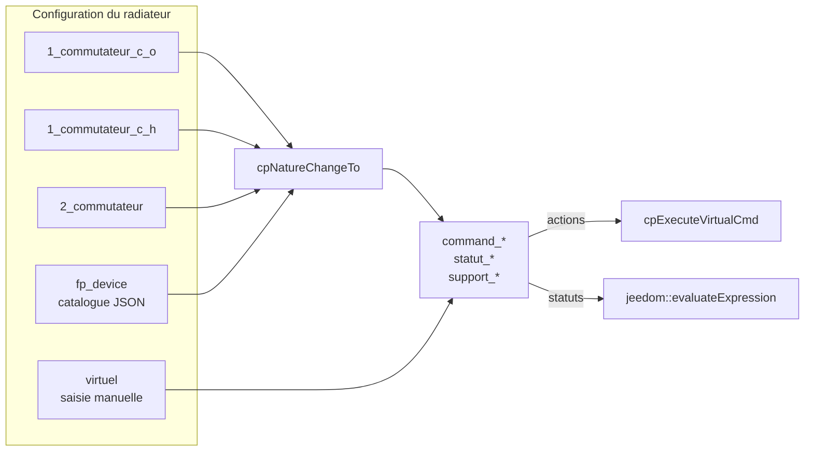
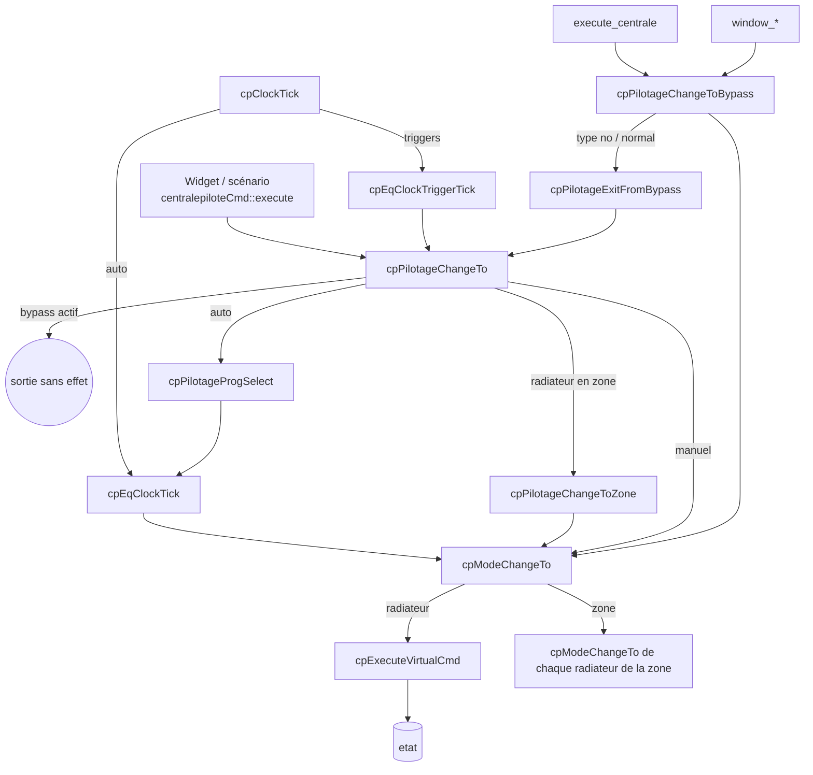

# Architecture du plugin Centrale Fil-Pilote (`centralepilote`)

> Document de référence pour les développeurs. Rédigé à partir de la branche `dev`,
> version 1.8.9 (commit `723afe9`), septembre 2026.
> La documentation utilisateur reste le [README](../README.md).
> Les points d'attention (§11) ont été vérifiés sur le banc de test de jeedom-dev (§12).
> Les lots de corrections 1 à 3 (§13) sont appliqués sur jeedom-dev.

## 1. Objet

Le plugin est une centrale de programmation pour radiateurs à fil pilote. Il ne pilote aucun
matériel directement : il orchestre des commandes déjà exposées par d'autres plugins Jeedom
(z2m, Zigbee, Z-Wave, virtuel, ...). Tout le code métier tient dans une seule classe PHP ;
il n'y a ni démon ni dépendance.

## 2. Arborescence

| Chemin | Rôle |
|---|---|
| `core/class/centralepilote.class.php` | Toute la logique : classes `centralepilote` (eqLogic) et `centralepiloteCmd` (cmd). |
| `core/class/centralepilotelog.class.php` | Simple wrapper de `log::add('centralepilote', ...)`. |
| `core/php/centralepilote.inc.php` | Point d'inclusion unique (core Jeedom + constantes + classes). |
| `core/php/centralepilote_const.inc.php` | `CP_VERSION`, à maintenir en phase avec `plugin_info/info.json`. |
| `core/ajax/centralepilote.ajax.php` | Actions ajax de la modale de programmation (`cpProgSave`, `cpProgLoad`, `cpProgList`, `cpProgDelete`, `cpProgClean`) et de la configuration (`cpFpSupportedList`, `cpModeGetList`). |
| `core/config/devices/*.inc.php` | Catalogue des équipements « fil pilote natif » (JSON dans des heredoc PHP). `fil_pilote_device_list.inc.php` agrège `device_list_z2m` et `device_list_virtual`. |
| `core/template/{dashboard,mobile}/` | Widgets custom : `centralepilote-radiateur` (radiateur **et** zone) et `centralepilote-centrale`. |
| `core/i18n/` | Traductions `fr_FR` / `en_US`. |
| `desktop/php/centralepilote.php` | Page de configuration ; inclut les panneaux `centralepilote_{centrale,radiateur,zone}.inc.php`, affichés selon le type. |
| `desktop/js/centralepilote.js` | Création des équipements typés, bascule des panneaux, sélection de commandes, choix de la nature. |
| `desktop/modal/modal.programmation.php` + `desktop/js/modal_programmation.js` | Éditeur visuel des programmes hebdomadaires. |
| `desktop/modal/modal.device_list.php` | Liste des équipements fil pilote natifs reconnus. |
| `plugin_info/install.php` | Install, migrations de versions, suppression. |
| `plugin_info/configuration.php` | Options globales (voir §9). |

## 3. Modèle de données

### 3.1 Trois types d'équipements dans une seule classe

Chaque eqLogic `centralepilote` porte `configuration.type`. Presque toutes les méthodes
commencent par un garde du type `cpIsType(...)`.

| Type | Cardinalité | Rôle |
|---|---|---|
| `centrale` | exactement 1, créée par `cpCentraleCreateDefault()` à l'install et à chaque update | Stocke les programmes et les températures de référence ; porte les commandes de délestage global. |
| `radiateur` | n | Traduit un mode fil pilote en commandes sur les équipements physiques. |
| `zone` | n | Groupe de radiateurs pilotés ensemble. L'appartenance est portée par le radiateur (`configuration.zone = <id zone>`). |

### 3.2 Configuration des radiateurs et zones (`eqLogic.configuration`)

| Clé | Valeurs | Remarque |
|---|---|---|
| `pilotage` | `confort`, `confort_1`, `confort_2`, `eco`, `horsgel`, `off`, `auto` | Pilotage « admin » souhaité, conservé pendant les bypass et le pilotage par zone. |
| `programme_id` | id de programme | Utilisé quand `pilotage = auto`. |
| `support_<mode>` | `0` / `1` | Modes supportés par l'équipement. |
| `fallback_<mode>` | code de mode ou vide | Mode de repli si le mode demandé n'est pas supporté. Utilisé seulement s'il est lui-même supporté ; sinon, `cpModeAlternative()` choisit le mode supporté le plus proche (§13, C1). L'interface le laisse **vide** tant que l'utilisateur ne le choisit pas explicitement. |
| `bypass_type` / `bypass_mode` | `no`/`no`, `delestage`/(`delestage`\|`eco`\|`horsgel`), `open_window`/`off` | Surcharge temporaire du pilotage. |
| `delestage_sortie_time` | `Y-m-d-H-i` ou vide | Échéance de la temporisation de sortie de délestage (§5.3). Clé interne, non saisie. |
| `trigger_list` | `{'Y-m-d-H-i': {type:'trigger_time', mode, time}}` | Changements de pilotage horodatés, triés par clé. (L'en-tête de la classe mentionne `trigger_mode`, le code utilise `trigger_time`.) |
| `temperature` | `#id#` d'une commande info | Température mesurée (optionnel). |
| `radiateur_temperature_<mode>` / `zone_temperature_<mode>` | valeur ou `#id#` | Consigne locale ; vide, c'est la valeur de la centrale qui s'applique. |
| **Radiateur uniquement** | | |
| `zone` | id de zone ou `''` | |
| `nature_fil_pilote` | `virtuel`, `1_commutateur_c_o`, `1_commutateur_c_h`, `2_commutateur`, `fp_device` | Voir §4. |
| `lien_commutateur`, `lien_commutateur_a/_b`, `fp_device_id` | `#eqLogicXX#` | Équipements physiques liés, selon la nature. |
| `command_<mode>` | `#id# && #id#` | Commandes action à exécuter pour passer dans le mode. |
| `statut_<mode>` | expression Jeedom | Vaut 1 si les équipements physiques sont dans ce mode (peut être vide). |
| `delestage_sortie_delai` | minutes (0, 5, 30, 60, ...) | Temporisation de sortie de délestage (§5.3). **Ignoré pour un radiateur dans une zone** : c'est la zone qui porte la temporisation, et le champ est masqué dans l'interface. |
| `puissance`, `notes` | libre | Informatif. |

La classe maintient aussi `_pre_save_cache` (propriété PHP, non persistée) : `preSave*`
y photographie l'état en base (nom, isEnable, zone, nature, modes supportés) pour que
`postSave*` détecte ce qui a changé (§6.5).

### 3.3 Configuration de la centrale

| Clé | Contenu |
|---|---|
| `prog_list` | Tableau des programmes indexé par id (§7). |
| `temperature_<mode>` | Consignes de référence (19 / 18 / 17 / 15 / 3 par défaut). |

### 3.4 Commandes

**Radiateur et zone** (créées dans `postInsert`, plus `refresh` dans `postSave`) :

| logicalId | Type | Contenu |
|---|---|---|
| `confort`, `confort_1`, `confort_2`, `eco`, `horsgel`, `off`, `auto` | action/other | Changement de pilotage. |
| `etat` | info/string, historisée | **Libellé traduit** du mode effectif (`cpModeGetName()`, ex. « Hors-Gel »). Relu par `cpModeGetFromCmd()`. |
| `pilotage` | info/string, historisée | `<mode>`, `auto`, `zone` ou `bypass`. |
| `programme`, `programme_id` | info/string | Programme courant. |
| `programme_select` | action/select | `listValue` régénérée par `cpCmdAllProgrammeSelectUpdate()`. |
| `trigger` | action/other | Options `trigger_type` = `trigger_time` (+ `mode`, `trigger_time` en timestamp Unix) ou `trigger_delete` (+ `id`). |
| `window_open`, `window_close`, `window_swap` | action/other | Bypass fenêtre ouverte. |
| `window_status` | info/string | `open` / `close`. |
| `delestage_exit` | action/other | Met fin à la temporisation de sortie de délestage. Visible uniquement pendant celle-ci. Sur une zone, libère aussi ses radiateurs. |
| `refresh` | action/other | Appelle `cpRefresh()`. |

**Centrale** : actions `normal`, `delestage`, `eco`, `horsgel` ; info `etat`, qui stocke le **code**
(`normal`, `delestage`, `eco`, `horsgel`), contrairement aux radiateurs ; infos `temp_ref_<mode>`.

### 3.5 Modes

La liste des modes est codée en dur dans `cpModeGetList()` : `confort`, `confort_1`, `confort_2`,
`eco`, `horsgel`, `off`. Chaque mode a un nom traduit, une icône, une grande icône et une couleur.
`auto` n'est pas un mode mais un pilotage (`cpPilotageExist()`).

## 4. Abstraction centrale : la « nature » ramenée au modèle virtuel

C'est la décision de conception structurante. Quelle que soit la façon dont le fil pilote est
réalisé, `cpNatureChangeTo()` (appelée depuis `preSaveRadiateur()` quand la nature ou les liens
changent) génère les expressions `command_<mode>` et `statut_<mode>`. Le reste du code ne
connaît que ces expressions.



| Nature | Modes forcés | Construction |
|---|---|---|
| `1_commutateur_c_o` | confort, off | Confort = `Off` du commutateur, Off = `On` ; statut via la commande `Etat` (0/1). |
| `1_commutateur_c_h` | confort, horsgel | Confort = `Off`, Hors-gel = `On`. |
| `2_commutateur` | confort, eco, horsgel, off | Table A/B : confort = off/off, eco = on/on, horsgel = off/on, off = on/off. |
| `fp_device` | ceux décrits dans le catalogue | L'équipement est identifié par `search_by_config_value` et `search_by_command_name`, puis chaque commande est construite selon son type (`single_cmd`, `cmd_value`, `double_cmd`, `double_cmd_value_and/or`, `expression` avec `__HUMAN_NAME__`) et convertie par `cmd::humanReadableToCmd()`. |
| `virtuel` | choisis par l'utilisateur | Saisis directement dans l'interface. |

Les natures à commutateurs retrouvent les commandes **par leur nom** (`On`, `Off`, `Etat`, via
`cmd::byEqLogicIdCmdName`). Un équipement dont les commandes portent d'autres noms doit passer
par la nature `virtuel`.

## 5. Hiérarchie de pilotage

Le mode physique d'un radiateur résulte de plusieurs couches, de la plus prioritaire à la moins
prioritaire :

| Priorité | Couche | Source | Effet sur `pilotage` (info) |
|---|---|---|---|
| 1 | Bypass délestage | Commande de la centrale, appliquée à tous les radiateurs et zones | `bypass` |
| 2 | Bypass fenêtre ouverte | `window_*` (refusé pendant un délestage, accepté pendant la temporisation de sortie) | `bypass` |
| 3 | Zone | `configuration.zone` non vide | `zone` |
| 4 | Auto | `pilotage = auto` et programme hebdomadaire | `auto` |
| 5 | Manuel | `pilotage = <mode>` | `<mode>` |
| — | Triggers | `trigger_list` : changent le pilotage (4/5) à une date donnée | — |

À toutes les couches, `cpModeAlternative()` substitue ensuite un mode supporté quand le mode demandé
ne l'est pas (§13, C1).

Une demande de pilotage reçue pendant un bypass n'est plus perdue : elle est **mémorisée** comme
pilotage admin et appliquée à la sortie du bypass. Exception : une demande **manuelle** (widget ou
scénario) pendant la temporisation de sortie de délestage est appliquée immédiatement et met fin à
cette temporisation ; sur une zone, elle libère aussi ses radiateurs (§13, lot 2 et lot 3).

### 5.1 Méthodes d'entrée



Le rôle de chaque méthode :

- `cpPilotageChangeTo($pilotage, $force, $manual)` modifie le pilotage admin. Elle délègue à la zone si
  le radiateur en fait partie, mémorise la demande sans l'appliquer si un bypass est actif (voir §5),
  puis persiste `pilotage`,
  recalcule la visibilité des commandes (`cpCmdResetDisplay`), fait un `save()` et un `refreshWidget()`.
- `cpModeChangeTo($mode, $force)` applique un mode physique. Elle ne connaît ni les bypass ni le
  pilotage. Sur une zone, elle propage le mode à ses radiateurs activés. Sans `$force`, elle ne fait
  rien si `etat` indique déjà ce mode.
- `cpPilotageChangeToBypass($type, $mode)` et `cpPilotageExitFromBypass($immediate)` entrent dans les
  bypass et en sortent. En sortie, c'est le `pilotage` admin mémorisé qui est restauré. Sans
  `$immediate`, la sortie d'un délestage peut être différée (§5.3).
- `cpEqBypassExitTick($now)` termine la temporisation quand son échéance est atteinte.

### 5.2 Zones

L'entrée dans une zone et la sortie sont détectées dans `postSaveRadiateur()`, par comparaison de
`configuration.zone` avec `_pre_save_cache`. Un radiateur en zone ne reçoit ni tick ni trigger :
`cpClockTick()` ne traite que les radiateurs avec `zone = ''`, et c'est la zone qui propage.

Une zone ne propage pas son mode à un radiateur qui est lui-même en bypass : le bypass du radiateur
reste prioritaire. Un radiateur en zone n'a pas de temporisation de sortie propre.

### 5.3 Délestage et sortie progressive

`execute_centrale()` met à jour l'`etat` de la centrale puis appelle `cpPilotageChangeToBypass()`
sur **les zones d'abord, puis les radiateurs** — l'ordre ne dépend donc pas de leurs noms.

En sortie (`normal`), un équipement dont `delestage_sortie_delai > 0` **reste en bypass** et note son
échéance dans `delestage_sortie_time`. À chaque `cron5`, `cpEqBypassExitTick()` compare l'échéance à
l'heure courante et termine la sortie le moment venu. Cela évite que tous les radiateurs redémarrent
en même temps.

La temporisation est portée par la **zone** pour les radiateurs qui en font partie, et par le
radiateur lui-même sinon. Quand une zone termine sa temporisation, elle fait d'abord sortir ses
radiateurs du bypass, puis leur applique son mode. Un nouveau délestage efface une échéance en
attente. Pendant la temporisation, le widget affiche « Fin de délestage à HH:MM » et un bouton
(commande `delestage_exit`) permet d'y mettre fin tout de suite.

## 6. Flux principaux

### 6.1 `cron5`

1. `cpRefresh()` sur chaque radiateur activé : si `statut_<mode attendu>` ne vaut pas 1, les
   `statut_*` sont évalués pour journaliser l'état réel, puis le mode attendu est réappliqué en force.
   Si aucun statut ne vaut 1 (équipement qui ne remonte pas son état), rien n'est fait.
   La réapplication passe par `cpModeChangeTo($mode, true)` : elle fonctionne aussi en bypass et en
   zone, et ne modifie pas le pilotage (§13, C3).
2. `cpClockTick()` :
   - fin des temporisations de sortie de délestage (`cpEqBypassExitTick()`), zones d'abord puis
     radiateurs hors zone ;
   - pour chaque zone, puis chaque radiateur hors zone, activé : `cpEqClockTick()` (ignoré si
     `pilotage` ≠ `auto`) puis `cpEqClockTriggerTick(now)`.

### 6.2 Exécution d'une commande

`centralepiloteCmd::execute()` aiguille selon le logicalId : `refresh`, puis les commandes de la
centrale, `programme_select`, `trigger`, `auto`, `window_*`, et enfin tout code de mode, qui
passe par `cpPilotageChangeTo()`. Il reste des commandes historiques (`manuel`, `prog_select`,
qui ne font que journaliser) et un raccourci de développement : une commande nommée `tick`
déclenche `cpClockTick()`.

### 6.3 Exécution physique (`cpExecuteVirtualCmd`)

`cpVirtualCmdCheck()` valide d'abord l'expression entière, sans rien exécuter : non vide, syntaxe
`#id#` ou `#id# && #id#…`, commandes existantes et de type action, équipements présents et activés.
Si la validation échoue, rien n'est exécuté, une ERROR précise la cause, et `etat` reste inchangé.
Sinon, chaque commande est exécutée ; une exception (`\Throwable`) interrompt la suite, avec une
ERROR qui indique combien de commandes étaient déjà parties. `cpModeChangeTo()` ne met `etat` à jour
que si l'exécution a réussi (§13, C2).

### 6.4 Programmes et triggers

`cpProgSave()` et `cpProgDelete()` réécrivent `prog_list` sur la centrale, régénèrent les listes
`programme_select` de tous les équipements, puis lancent un `cpClockTick()` immédiat. Supprimer un
programme ramène les équipements qui l'utilisaient sur le programme 0.

### 6.5 Sauvegarde d'un équipement

```
preSave → preSave{Radiateur,Zone,Centrale}
   ├─ nouvel équipement (id vide) : valeurs par défaut, _pre_save_cache = null
   └─ équipement existant : photographie de l'état en base dans _pre_save_cache
                            (radiateur : cpNatureChangeTo() si la nature ou les liens changent,
                             exception si fp_device sans fp_device_id)
postInsert → création des commandes selon le type
postSave → postSave{Radiateur,Zone,Centrale}
   ├─ nouvel équipement : création de la commande refresh
   └─ équipement existant : isEnable modifié → cpEqChangeToEnable()
                            modes supportés modifiés → visibilité + cpPilotageChangeTo(admin)
                            zone modifiée → cpPilotageChangeToZone() / cpPilotageExitFromZone()
                            centrale → mise à jour des temp_ref_*
```

Beaucoup de méthodes métier appellent elles-mêmes `$this->save()`. Une seule action utilisateur
peut donc repasser plusieurs fois par ce cycle, de façon réentrante depuis `postSave`.

## 7. Format d'un programme

```json
{
  "id": "12",
  "name": "Semaine bureau",
  "short_name": "Bureau",
  "mode_horaire": "horaire",
  "agenda": {
    "lundi":   { "0": "eco", "1": "eco", "...": "...", "23": "eco" },
    "...": {},
    "dimanche": { "0": "eco", "...": "..." }
  }
}
```

En mode `demiheure`, les clés horaires deviennent `"<H>_00"` et `"<H>_30"`. L'id `0` est le
programme par défaut, tout en eco, recréé si absent. Les nouveaux programmes reçoivent le premier
id libre à partir de 10. La liste est stockée comme tableau associatif dans la configuration de la
centrale, et relue (donc décodée) à chaque appel de `cpProgGetList()`.

## 8. Affichage

`toHtml()` renvoie le widget standard si l'option `standard_widget` est cochée. Sinon :
`toHtml_radiateur()` pour les radiateurs **et** les zones (dashboard comme mobile), et
`toHtml_centrale()` pour la centrale. `toHtml_mobile_radiateur()` existe mais n'est plus appelée.
Le widget calcule à la volée le prochain changement de programme
(`cpProgNextModeFromClockTick()`), la consigne (`cpEqGetTemperatureCible()`) et la température
mesurée. Les options `mode_icon_color` et `mode_icon_color_mobile` colorent les icônes de modes.

## 9. Cycle de vie du plugin

| Point d'entrée | Rôle |
|---|---|
| `centralepilote_install()` | Crée la centrale et le programme par défaut ; enregistre `config.version`. |
| `centralepilote_update()` | Recrée la centrale si besoin, sort les radiateurs des zones disparues, puis lance les migrations `centralepilote_update_v_X` selon `config.version` (comparées avec `version_compare()`). |
| `centralepilote::start()` | Au démarrage de Jeedom : si le flag `clean_stop` est absent (arrêt non propre), `cpRefresh()` de tous les radiateurs. |
| `centralepilote::stop()` | Positionne `clean_stop`. |

Options globales (`config`, plugin `centralepilote`) : `standard_widget`, `mode_icon_color`,
`mode_icon_color_mobile`, ainsi que `version` et `clean_stop`, qui sont internes.

En développement, un `git pull` dans `plugins/centralepilote` ne déclenche pas
`centralepilote_update()` : `config.version` reste à l'ancienne valeur. Sur jeedom-dev, il vaut
1.8.5 alors que le code est en 1.8.9. Il faut donc penser à lancer la mise à jour à la main
avant de tester une migration.

## 10. Conventions de code

Les méthodes métier sont préfixées `cp` et groupées par domaine : `cpCentrale*`, `cpMode*`,
`cpProg*`, `cpPilotage*`, `cpRad*`, `cpZone*`, `cpEq*` (radiateur ou zone), `cpCmd*`. Les
variables locales sont préfixées `v_`, les paramètres `p_`. Chaque méthode est précédée d'un
cartouche « Method / Description / Parameters / Returned value ». Les `TBC` marquent des points
laissés en suspens.

Les journaux passent par `centralepilote::log()` ou `centralepilotelog::log()`, deux façades
équivalentes sur `log::add('centralepilote', ...)`.

Pour publier une version, il faut mettre `CP_VERSION` et `info.json` à jour ensemble. Les
branches `dev`, `beta` et `main` correspondent aux canaux Jeedom.

## 11. Points d'attention connus

Cette section a été relevée lors de la revue de septembre 2026, puis vérifiée sur le banc de test (§12).
Elle sera à mettre à jour au fil des corrections. Dans la colonne « Vérification », « T*n* » renvoie
au test du §12.2.

| # | Sujet | Vérification |
|---|---|---|
| 1 | Supprimer une zone laisse ses radiateurs avec un `zone` orphelin (pas de `preRemove`). Le pilotage affiché reste « zone », les commandes sont ignorées (seulement une ligne DEBUG « Unexpected missing zone object ») et les ticks les excluent. Par lecture du code : après un délestage, un radiateur orphelin resterait en off indéfiniment. | **Corrigé** (lot 1, C4) |
| 2 | `cpRefresh()` réapplique le mode via `cpPilotageChangeTo()`. En bypass, rien n'est corrigé, alors que le WARNING annonce « Force l'état attendu ». Hors bypass, la conf `pilotage` est réécrite avec le mode effectif (après repli). | **Corrigé** (lot 1, C3) |
| 3 | La sortie de délestage traite les équipements par ordre alphabétique de nom, les zones après leurs radiateurs dans le cas testé. Un radiateur en zone avec délai ne crée pas son trigger (« in zone pilotage ») et reçoit immédiatement le mode de la zone : pas de sortie progressive. Son `pilotage` reste affiché « bypass » durablement. Les radiateurs en zone qui sortent avant leur zone reprennent d'abord le mode délesté. | **Corrigé** (lot 2 et lot 3) |
| 4 | L'`etat` des radiateurs et zones stocke un libellé traduit, relu pour retrouver le mode. Un libellé inconnu devient `eco` sans alerte. | Lecture de code (voir aussi 16) |
| 5 | `cpProgSave()` : `$p_id === 0` est toujours faux depuis l'ajax (chaîne `"0"`), donc le programme par défaut est modifiable. Un JSON invalide provoque une `Error` fatale. | Confirmé (PHP 8.3) |
| 6 | Un trigger qui se déclenche pendant une fenêtre ouverte est supprimé sans être appliqué. À la fermeture, le radiateur revient à l'ancien pilotage. Le log annonce à tort une sortie du bypass. | **Corrigé** (lot 2) |
| 7 | `cpProgNextModeFromClockTick()` : la limite de 250 itérations est inférieure aux 336 créneaux d'une semaine en demi-heure. Au-delà de 125 h, aucun prochain changement n'est affiché. En horaire, la détection « semaine complète » ne marche qu'à la minute 00, d'où un faux « Loop detected ». | Confirmé (T5, PHP 7.4) |
| 8 | `postInsert` de la centrale initialise `temperature_confort_1`… au lieu de `temp_ref_confort_1`… | Lecture de code |
| 9 | `cpEqGetTemperatureActuelle()` : `round('')` lève une `TypeError` en PHP 8 si le capteur n'a pas de valeur. Sans effet sur jeedom-dev (PHP 7.4). | Confirmé (PHP 8.3) |
| 10 | Changer de nature ne vide pas les `command_*` et `statut_*` des modes devenus inutiles. Ils continuent de viser l'ancien équipement lié et faussent le diagnostic de `cpRefresh()`. Recocher un de ces modes dans l'interface réactiverait ces commandes. | Confirmé (T6) |
| 11 | `install.php` compare des versions sous forme de chaînes (`$v_version < '1.2'`). `'1.10' < '1.2'` est vrai : les anciennes migrations se relanceront à partir de la version 1.10. | **Corrigé** (lot 2) |
| 12 | Performance : `cpCentraleGet()` recharge `eqLogic::byType()` à chaque appel, au moins quatre fois par rendu de widget. `cpCmdResetDisplay()` sauvegarde une dizaine de commandes à chaque changement de pilotage. | Lecture de code |
| 13 | Encodages hétérogènes : `install.php` et `core/config/devices/*.inc.php` sont en ISO-8859-1 avec des fins de ligne CRLF, le reste est en UTF-8. Les accents ne sont que dans les commentaires. | Constaté |
| 14 | `core/i18n/en_US.json` était illisible (ISO-8859-1 et erreur de syntaxe). | **Corrigé** le 11/09/2026 |
| 15 | « Dupliquer » un radiateur : `eqLogic::copy()` fait `setId('')` puis `save()`, donc `preSaveRadiateur()` le traite comme un nouvel équipement. Sont réinitialisés : nature (→ `virtuel`), pilotage, programme, triggers, consignes, délai de délestage, modes supportés et capteur de température. Le lien vers l'équipement et les commandes sont conservés : **la copie, active, pilote le même équipement physique que l'original**, et les deux se contredisent à chaque cron5. | **Corrigé** (lot 2, T7 rejoué le 12/09) |
| 16 | Un `etat` vide (radiateur neuf, copie) est interprété comme `eco` par `cpModeGetFromCmd()`. La première demande `eco`, ou un pilotage `eco` déjà positionné, est ignorée (« already in mode 'eco', skip »). Le radiateur n'est commandé qu'au premier `cpRefresh()`, et seulement s'il a des statuts. | **Corrigé** (lot 2) |
| 17 | `cpModeAlternative()` n'applique qu'un seul niveau de repli et ne vérifie pas que le mode de repli est supporté. Sans repli ou avec un repli non supporté, `cpModeChangeTo()` exécute une commande vide (WARNING) **et met quand même `etat` à jour** : l'état affiché est faux. `cpRefresh()` réessaie ensuite à chaque cron5. Conséquences constatées : un C/O en hors-gel reste en confort, et un C/H **continue de chauffer pendant un délestage**. | **Corrigé** (lot 1, C1 et C2) |
| 18 | `cpProgNextModeFromClockTick()` : quand le prochain changement tombe le même jour de la semaine mais la semaine suivante, le jour n'est pas renseigné. Le widget affiche alors l'heure comme si c'était aujourd'hui. | Confirmé (T5) |

## 12. Banc de test (jeedom-dev)

### 12.1 Composition

Tout est rangé dans l'objet « Tests ». Les simulateurs sont des équipements du plugin `virtual` dont
chaque action met à jour l'info d'état : la boucle commande → statut est fermée, ce qui permet de
vérifier `cpRefresh()`.

| id | Équipement | Configuration |
|---|---|---|
| 676 | TB Zone Jour | zone, auto sur TB Horaire |
| 678 | TB Rad CO | 1_commutateur_c_o sur Commutateur-1-A, manuel eco |
| 679 | TB Rad CH | 1_commutateur_c_h sur Commutateur-1-B, zone Jour |
| 680 | TB Rad 2C | 2_commutateur sur Commutateur-2-A/2-B, zone Jour, délai de sortie de délestage 30 min |
| 681 | TB Rad FP6 | fp_device sur Modele FilPilote (6 ordres), auto sur TB Horaire, délai 30 min, capteur de TB Capteurs (675) |
| 682 | TB Rad FP4 | fp_device sur Modele FilPilote 4orders, manuel confort |
| 683 | TB Rad Virtuel | créé en `virtuel` sur Commutateur-3-A/3-B, puis passé en 1_commutateur_c_o sur 3-A (T6). Orphelin de la zone 677 après T8, sorti de la zone par `cpZoneCleanOrphans()`. |
| 684 | TB Rad UI | fp_device sur Modele FilPilote 4orders B, créé entièrement par l'interface (replis vides). Hors zone. |
| 685 | TB Rad FP6 copie | copie de 681 (T7), désactivée |

Programmes : TB Horaire (id 10, confort aux heures paires, eco aux impaires) et TB Demi-heure (id 11,
tout en eco sauf le jeudi 12h30–13h00). Les radiateurs 678 à 683 ont reçu des replis explicites
(confort → eco, eco → confort, horsgel → eco, off → eco, confort_1/2 → confort). Les anciens
radiateurs Chambre, Salon et Bureau (597 à 599) sont désactivés.

### 12.2 Tests réalisés le 11/09/2026

| Test | Scénario | Points |
|---|---|---|
| T1 | TB Rad UI → `confort_1` (sans repli) ; TB Rad CO → `horsgel` (repli non supporté) ; puis `refresh` | 17, 2 |
| T2 | Délestage sur la centrale ; dérive manuelle du simulateur de FP4 puis `refresh` | 17, 2 |
| T3 | Sortie de délestage : 2C (zone + délai) comparé à FP6 (hors zone + délai) | 3 |
| T4 | Trigger eco à +10 min sur FP4, fenêtre ouverte avant l'échéance | 6 |
| T5 | Code réel de `cpProgNextModeFromClockTick()` exécuté isolément avec les programmes du banc et un programme synthétique | 7, 18 |
| T6 | TB Rad Virtuel : `virtuel` → `1_commutateur_c_o`, puis dérive et `refresh` | 10 |
| T7 | Duplication de TB Rad FP6 par l'interface | 15 |
| T8 | Suppression de TB Zone Jetable par l'interface, puis commande sur TB Rad Virtuel | 1 |

### 12.3 Outillage

Les tests passent par l'API JSON-RPC locale (`core/api/jeeApi.php`), qui s'exécute en `www-data` et
suit le même cycle `preSave`/`postSave` que l'interface. Le client utilisé (`/tmp/tb/lib.php`)
déchiffre la clé API à chaque appel et ne la stocke pas. Il se trouve dans `/tmp`, donc il n'est pas
persistant. Deux précautions :

- `eqLogic::save` enchaîne deux `save()` à la création. Il faut créer un radiateur avec son seul
  `type`, puis le configurer par un second appel, comme le fait l'interface.
- Les tâches différées lancées par SSH doivent être détachées avec `setsid`, sinon elles peuvent être
  tuées à la fermeture de la session.

## 13. Corrections

### 13.1 Lot 1 (11/09/2026) : repli, exécution des commandes, resynchronisation, zones

Appliqué sur jeedom-dev à 17h11, non commité. Fichiers : `core/class/centralepilote.class.php`
(+135/−76) et `plugin_info/install.php` (+3, encodage ISO-8859-1 et CRLF conservés).

| # | Méthode(s) | Correction | Points |
|---|---|---|---|
| C1 | `cpModeAlternative()` | 1. mode supporté : gardé ; 2. repli configuré, **seulement s'il est supporté** ; 3. sinon, mode supporté le plus proche dans l'ordre confort → confort_1 → confort_2 → eco → horsgel → off, et celui qui chauffe le moins à égalité (INFO dans le log) ; 4. aucun mode supporté : retourne `''` avec un WARNING, rien n'est exécuté. | 17 |
| C2 | `cpModeChangeTo()`, `cpExecuteVirtualCmd()`, nouvelle `cpVirtualCmdCheck()` | Validation complète de l'expression avant toute exécution (§6.3). En cas d'erreur : rien n'est exécuté, ERROR explicite, `etat` inchangé. Capture de `\Throwable` à l'exécution. `etat` n'est mis à jour qu'en cas de succès. | 17 |
| C3 | `cpRefresh()` | Réapplication par `cpModeChangeTo($v_mode, true)` au lieu de `cpPilotageChangeTo()`. Fonctionne en bypass et en zone, et ne modifie plus le pilotage. Message : « Réapplique l'état attendu ». | 2 |
| C4 | `preRemove()`, nouvelle `cpZoneCleanOrphans()`, `centralepilote_update()` | À la suppression d'une zone, ses radiateurs en sortent (via `postSaveRadiateur()` → `cpPilotageExitFromZone()`). `cpZoneCleanOrphans()` répare les orphelins existants ; elle est appelée par `centralepilote_update()` et peut être lancée à la main dans un bloc Code de scénario. | 1 |

Effets des replis automatiques (C1) quand aucun repli n'est configuré :

| Nature | confort_1 | confort_2 | eco | horsgel | off |
|---|---|---|---|---|---|
| 1_commutateur_c_o | confort | confort | off | off | off |
| 1_commutateur_c_h | confort | horsgel | horsgel | horsgel | horsgel |

### 13.2 Vérifications du lot 1

| Test | Résultat |
|---|---|
| T1 rejoué | TB Rad UI : confort_1 → confort. TB Rad CO : horsgel → off. États cohérents, pilotage conservé, `refresh` sans écart. |
| T2 rejoué | TB Rad CH en hors-gel pendant le délestage. Dérive de FP4 corrigée pendant le délestage, pilotage admin conservé. |
| C2 | `#530# && #99999#` et `#530# &&` : rien d'exécuté, ERROR explicite, état inchangé. |
| T8 rejoué | Suppression de TB Zone Jetable 2 par l'interface : TB Rad UI sort de la zone et reprend son pilotage eco. |
| Orphelin | Avant nettoyage, TB Rad Virtuel restait bloqué en off après un délestage (conséquence du point 1). `cpZoneCleanOrphans()` l'a sorti de la zone : pilotage eco, confort par repli. |
| Non-régression | Cron5 (refresh, ticks, triggers) sans erreur ; trigger de sortie de délestage de FP6 exécuté à 17h45 (retour en auto). |

Restent ouverts : points 3 à 16 et 18, hors 14 (déjà corrigé).

### 13.3 Lot 2 (11/09/2026) : duplication, bypass, sortie de délestage, versions

| # | Méthode(s) | Correction | Points |
|---|---|---|---|
| C5 | `preSaveRadiateur()` | Une copie (id vide mais nature déjà renseignée) est **désactivée**, ses liens physiques, commandes, statuts, capteur, triggers et bypass sont effacés. Le reste de la configuration est conservé. | 15 |
| C6 | `cpModeGetFromCmd()`, `cpRefresh()` | Un `etat` vide vaut « inconnu » et non plus `eco` : la première demande d'un équipement neuf est exécutée, et `cpRefresh()` applique le pilotage attendu. | 16 |
| C7 | `cpPilotageChangeTo()` | Une demande reçue pendant un bypass est mémorisée puis appliquée à la sortie. Une demande manuelle pendant la temporisation de sortie est appliquée tout de suite et met fin à la temporisation ; sur une zone, elle libère aussi ses radiateurs. | 6, 3 |
| C8 | `cpZoneModeChangeTo()`, `execute_centrale()`, `cpPilotageExitFromBypass()`, `cpClockTick()` | Une zone ne commande pas ses radiateurs en bypass ; les zones sont traitées avant les radiateurs ; la temporisation garde le bypass jusqu'à son échéance, via `delestage_sortie_time` et `cpEqBypassExitTick()`. | 3 |
| C9 | `centralepilote_update()` | `version_compare()` au lieu d'une comparaison de chaînes. | 11 |

### 13.4 Lot 3 (12/09/2026) : la zone maîtresse du délestage, temporisation visible

| # | Fichier(s) | Correction |
|---|---|---|
| C10 | `centralepilote.class.php` | Un radiateur dans une zone n'a pas de temporisation propre : `cpPilotageExitFromBypass()` ne pose une échéance que hors zone. Une zone peut en porter une, et elle fait sortir ses radiateurs à son échéance. `cpClockTick()` traite les zones puis les radiateurs hors zone. |
| C11 | `centralepilote.class.php`, widgets dashboard et mobile | Nouvelle commande action `delestage_exit`, visible uniquement pendant la temporisation. Le bandeau affiche « Fin de délestage à HH:MM », et un bouton vert (icône `mdi-lock-clock`, infobulle « Forcer la sortie du délestage ») placé sous celui de la fenêtre permet d'y mettre fin. Utilisable aussi en scénario. |
| C12 | `centralepilote.php`, `centralepilote.js` | Le champ « Sortie délestage » est remplacé par « Défini par la zone » dès qu'une zone est choisie, et réapparaît sinon. La valeur enregistrée est conservée. |
| C13 | `install.php` | Migration `centralepilote_update_v_1_9_0()` : crée `delestage_exit` sur les radiateurs et zones existants. |

**À faire avant publication :** la migration se déclenche pour toute version antérieure à 1.9.0 alors
que `CP_VERSION` vaut 1.8.9 ; elle se relancera donc à chaque mise à jour (sans effet, car elle
vérifie l'existence de la commande) tant que la version n'aura pas été portée à **1.9.0**.

### 13.5 Vérifications des lots 2 et 3

| Test | Résultat |
|---|---|
| T7 rejoué (duplication par l'interface) | Copie créée désactivée, sans équipement fil pilote ni commandes ; l'original n'est plus perturbé. |
| T4 rejoué | Trigger posé pendant une fenêtre ouverte : mémorisé, puis appliqué à la fermeture. |
| Demande manuelle pendant un délestage | Mémorisée, appliquée au retour à normal. |
| Radiateur neuf (`TB Rad Neuf`) | Commandé dès sa création, `etat` renseigné. |
| Temporisation zone 5 min / radiateurs 30 min | Seules la zone et les radiateurs hors zone portent une échéance ; à l'échéance, la zone et ses radiateurs repartent ensemble. |
| Forçage manuel pendant la temporisation | Appliqué immédiatement, échéance annulée. |
| Bouton `delestage_exit` | Sur la zone : libère la zone et ses radiateurs. Sur un radiateur hors zone : lui seul. Hors temporisation : sans effet, message dans le log. |
| Interface et widgets | Vérifiés visuellement dans le navigateur. |
| Non-régression | Une nuit de `cron5` sans erreur ni warning. |

Restent ouverts : points 4, 5, 7, 8, 9, 10, 12, 13 et 18.
